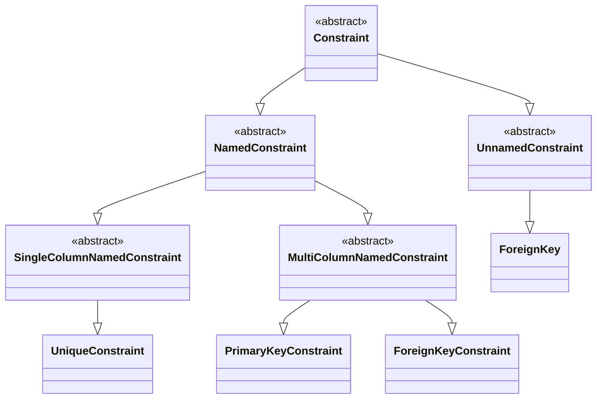

# SQL constraints

Welcome to the comprehensive documentation of our **SQL constraint classes**.

Below, you'll discover detailed explanations of essential and abstract **SQL constraint classes**, along with additional insights.

Whether you're a beginner or an experienced developer, this guide aims to provide clarity and guidance.

# Table  of contents

- [**Class diagram**](#class-diagram)
- [**Unnamed constraints**](#unnamed-constraints)
  - [ForeignKey](#foreignkey)
- [**Named constraints**](#named-constraints)
  - [ForeignKeyConstraint](#foreignkeyconstraint)
  - [PrimaryKeyConstraint](#primarykeyconstraint)
  - [UniqueConstraint](#uniqueconstraint)
- [**Abstract classes**](#abstract-classes)
  - [Constraint](#constraint)
  - [MultiColumnNamedConstraint](#multicolumnnamedconstraint)
  - [NamedConstraint](#namedconstraint)
  - [SingleColumnNamedConstraint](#singlecolumnnamedconstraint)
  - [UnnamedConstraint](#unnamedconstraint)


## **Class diagram**



This class diagram shows the inheritance of the classes.

## **Unnamed constraints**

## ForeignKey

Represents a **unnamed FOREIGN KEY** constraint in SQL.

This class must be used in a <a href="./table.md#column">table's column</a>.

This class inherits from `UnnamedConstraint` and provides functionality
specific to the **unnamed FOREIGN KEY** constraint.

This class is in `pysqlquery.constraints` package.

### Methods

#### `__init__(ref_table: str, ref_column: str, *, on_delete: str | None, on_update: str | None) -> None`

Constructs a `ForeignKey` instance representing the **unnamed FOREIGN KEY** constraint.

**Parameters**

- `ref_table : str` - The referenced table.
- `ref_column : str` - The referenced column name.
- `on_delete : str | None` - The ON DELETE clause.
- `on_update : str | None` - The ON UPDATE clause.

Available values for `on_delete` and `on_update` params:

- `'cascade'`
- `'set null'`
- `'set default'`
- `'no action'`
- `'restrict'`

#### `__str__ -> str`

Returns a string representation of the class instance in SQL format.

The returned string will be used for constructing the **SQL queries**.

### Properties

#### `@property column -> str`

Returns the column's name that this constraint belongs to.

#### `@property ref_table -> str`

Returns the referenced table.

#### `@property ref_column -> str`

Returns the referenced column name.

#### `@property on_delete -> str`

Returns the ON DELETE clause.

#### `@property on_update-> str`

Returns the ON UPDATE clause.

### Examples

Adding it in a <a href="./table.md#column">table's column</a> ...

```python
>>> from pysqlquery import Table, Column, Integer, ForeignKey
>>> class MyTable(Table):
...     fk_col = Column(Integer, ForeignKey('other_table', 'id', on_delete='cascade'))
...
>>> my_table = MyTable()
>>> print(my_table)
```

... the result will be this:

```sql
CREATE TABLE MYTABLE (
    fk_col INTEGER NOT NULL,

    FOREIGN KEY (fk_col) REFERENCES OTHER_TABLE(id) ON DELETE CASCADE
);
```

## **Named constraints**

## ForeignKeyConstraint

Represents a **named FOREIGN KEY** constraint in SQL.

This class can be used in <a href="./table.md#__constraints__">table's `__constraints__` list</a>.

This class inherits from [MultiColumnNamedConstraint](#multicolumnnamedconstraint) and provides functionality specific to the **named FOREIGN KEY** constraint.

This class is in `pysqlquery.constraints` package.

### Methods

#### `__init__(ref_table: str, ref_column: str, *, on_delete: str | None, on_update: str | None) -> None`

Constructs a `ForeignKeyConstraint` instance representing the **named FOREIGN KEY** constraint.

**Parameters**

- `name : str` - The constraint's name.
- `column : str | list[str]` - The column's name(s) that this constraint belongs to.
- `ref_table : str` - The referenced table.
- `ref_column : str | list[str]` -  The referenced column name(s) (this must be the same type than column parameter (and the same size when column is a list)).
- `on_delete : str | None` - The ON DELETE clause.
- `on_update : str | None` - The ON UPDATE clause.

Available values for `on_delete` and `on_update` params:

- `'cascade'`
- `'set null'`
- `'set default'`
- `'no action'`
- `'restrict'`

#### `__str__ -> str`

Returns a string representation of the class instance in SQL format.

The returned string will be used for constructing the **SQL queries**.

### Properties

#### `@property name -> str`

Returns the constraint's name.

#### `@property column -> str | list[str]`

Returns the column's name(s) that this constraint belongs to.

#### `@property ref_table -> str`

Returns the referenced table.

#### `@property ref_column -> str`

Returns the referenced column name.

#### `@property on_delete -> str`

Returns the ON DELETE clause.

#### `@property on_update-> str`

Returns the ON UPDATE clause.

### Examples

A simple constraint

```python
>>> from pysqlquery.constraints import ForeignKeyConstraint
>>> fk_const = ForeignKeyConstraint(
...     'fk_table_other_table',
...     'fk_col',
...     'other_table',
...     'id'
... )
>>> print(fk_const)
```
```sql
CONSTRAINT fk_table_other_table FOREIGN KEY (fk_col) REFERENCES OTHER_TABLE(id)
```

With ON DELETE and ON UPDATE clauses

```python
>>> fk_const = ForeignKeyConstraint(
...     'fk_table_other_table',
...     'fk_col',
...     'other_table',
...     'id',
...     on_delete='cascade',
...     on_update='no action'
... )
>>> print(fk_const)
```
```sql
CONSTRAINT fk_table_other_table FOREIGN KEY (fk_col) REFERENCES OTHER_TABLE(id) ON DELETE CASCADE ON UPDATE NO ACTION
```

A multi column constraint

```python
>>> fk_const = ForeignKeyConstraint(
...     'fk_table_other_table',
...     ['fk_col_1', 'fk_col_2'],
...     'other_table',
...     ['id_1', 'id_2']
... )
>>> print(fk_const)
```
```sql
CONSTRAINT fk_table_other_table FOREIGN KEY (fk_col_1, fk_col_2) REFERENCES OTHER_TABLE(id_1, id_2)
```

In a <a href="./table.md#__constraints__">table's `__constraints__` list</a>

```python
>>> class MyTable(Table):
...     fk_col = Column(Integer)
...     __constraints__ = [
...         ForeignKeyConstraint(
...             'fk_my_table_other_table',
...             'fk_col',
...             'other_table',
...             'id'
...         )
...     ]
...
>>> my_table = MyTable()
>>> print(my_table)
```

```sql
CREATE TABLE MYTABLE (
    fk_col INTEGER NOT NULL
);

ALTER TABLE MYTABLE
    ADD CONSTRAINT fk_my_table_other_table FOREIGN KEY (fk_col) REFERENCES OTHER_TABLE(id);
```

## PrimaryKeyConstraint

Represents a **named PRIMARY KEY** constraint in SQL.

This class can be used in <a href="./table.md#__constraints__">table's `__constraints__` list</a>.

This class inherits from [MultiColumnNamedConstraint](#multicolumnnamedconstraint) and provides functionality specific to the **named PRIMARY KEY** constraint.

This class is in `pysqlquery.constraints` package.

### Methods

#### `__init__(self, name: str, column: str | list[str]) -> None`

Constructs a `PrimaryKeyConstraint` instance representing the **named PRIMARY KEY** constraint.

**Parameters**

- `name : str` - The constraint's name.
- `column : str | list[str]` - The column's name(s) that this constraint belongs to.

#### `__str__ -> str`

Returns a string representation of the class instance in SQL format.

The returned string will be used for constructing the **SQL queries**.

### Properties

#### `@property name -> str`

Returns the constraint's name.

#### `@property column -> str | list[str]`

Returns the column's name(s) that this constraint belongs to.

### Examples

A simple constraint

```python
>>> pk_const = PrimaryKeyConstraint('pk_table', 'id')
>>> print(pk_const)
```
```sql
CONSTRAINT pk_table PRIMARY KEY (id)
```

A multi column constraint

```python
>>> pk_const = PrimaryKeyConstraint('pk_table', ['id_1', 'id_2'])
>>> print(pk_const)
```
```sql
CONSTRAINT pk_table PRIMARY KEY (id_1, id_2)
```

In a <a href="./table.md#__constraints__">table's `__constraints__` list</a>

```python
>>> class MyTable(Table):
...     id = Column(Integer)
...     __constraints__ = [
...         PrimaryKeyConstraint('pk_my_table', 'id')
...     ]
...
>>> my_table = MyTable()
>>> print(my_table.id.primary_key)
```
```sql
CREATE TABLE MYTABLE (
    id = INTEGER NOT NULL
);

ALTER TABLE MYTABLE
    ADD CONSTRAINT pk_my_table PRIMARY KEY (id);
```

## UniqueConstraint

Represents a **named UNIQUE** constraint in SQL.

This class can be used in <a href="./table.md#__constraints__">table's `__constraints__` list</a>.

This class inherits from [SingleColumnNamedConstraint](#singlecolumnnamedconstraint) and provides functionality specific to the **named UNIQUE** constraint.

This class is in `pysqlquery.constraints` package.

### Methods

#### `__init__(self, name: str, column: str) -> None`

Constructs a `PrimaryKeyConstraint` instance representing the **named UNIQUE** constraint.

**Parameters**

- `name : str` - The constraint's name.
- `column : str` - The column's name that this constraint belongs to.

#### `__str__ -> str`

Returns a string representation of the class instance in SQL format.

The returned string will be used for constructing the **SQL queries**.

### Properties

#### `@property name -> str`

Returns the constraint's name.

#### `@property column -> str`

Returns the column's name that this constraint belongs to.

### Examples

A simple constraint

```python
>>> un_const = UniqueConstraint('un_table_column', 'column')
>>> print(un_const)
```
```sql
CONSTRAINT un_table_column UNIQUE (column)
```

In a <a href="./table.md#__constraints__">table's `__constraints__` list</a>

```python
>>> class MyTable(Table):
...     my_column = Column(CHAR)
...     __constraints__ = [
...         UniqueConstraint('un_my_table_my_column', 'my_column')
...     ]
...
>>> my_table = MyTable()
>>> print(my_table)
```
```sql
CREATE TABLE MYTABLE (
    my_column CHAR NOT NULL
);

ALTER TABLE MYTABLE
    ADD CONSTRAINT un_my_table_my_column UNIQUE (my_column);
```

## **Abstract classes**

## Constraint

Abstract class for construct **abstract SQL constraint classes**.

This class provides the basic structure for construct
abstract classes for **kind of SQL constraints**.

This class **must be inherited** by abstract one.

This class is in `pysqlquery.constraints.base` package.

### Methods

#### `@abstractmethod __str__ -> str`

Returns a string representation of the class instance in SQL format.

The returned string will be used for constructing the **SQL queries**.

It's an abstract method, **the concrete subclasses must implement it**.

## MultiColumnNamedConstraint

Abstract class for construct **multi column named SQL constraint classes**.

This class inherits from [**NamedConstraint**](#namedconstraint) and provides the basic structures for constructing concrete classes that represents multi column named SQL constraints or another abstract classes for other kind of multi column named SQL constraints.

This class **must be inherited** by concrete or another abstract one.

This class is in `pysqlquery.constraints.base` package.

### Methods

#### `__init__(name: str, column: str | list[str]) -> None`

**Parameters**

- `name : str` - The constraint's name.
- `column : str` - The column's name(s) that this constraint belongs to.

### Properties

#### `@property column -> str | list[str]`

Returns the column's name(s) that this constraint belongs to.

## NamedConstraint

Abstract class for construct **named SQL constraint classes**.

This class inherits from [**Constraint**](#constraint) and provides the basic structures for construct abstract classes for kind of named SQL constraints.

This class **must be inherited** by abstract one.

This class is in `pysqlquery.constraints.base` package.

### Methods

#### `__init__(name: str) -> None`

**Parameters**

- `name : str` - The constraint's name.

### Properties

#### `@property name -> str`

Returns the constraint's name.

## SingleColumnNamedConstraint

Abstract class for construct single column named SQL constraint classes.

This class inherits from [**NamedConstraint**](#namedconstraint) and provides the basic structures for construct concrete classes that represents single column named SQL constraints or another abstract classes for other kind of single column named SQL constraints.

This class **must be inherited** by concrete or another abstract one.

This class is in `pysqlquery.constraints.base` package.

### Methods

#### `__init__(name: str, column: str) -> None`

**Parameters**

- `name : str` - The constraint's name.
- `column : str` - The column's name that this constraint belongs to.

### Properties

#### `@property column -> str`

Returns the column's name that this constraint belongs to.

## UnnamedConstraint

Abstract class for construct unnamed SQL constraint classes.

This class inherits from [**Constraint**](#constraint) and provides the basic structures for constructconcrete classes that represents unnamed SQL constraints or another
abstract classes for other kind of unnamed SQL constraints.

This class **must be inherited** by concrete or another abstract one.

This class is in `pysqlquery.constraints.base` package.

### Methods

#### `__init__() -> None`

Constructs a `UnnamedConstraint` instance, **it's used by subclass**.

### Properties

#### `@property column -> str`

Returns the column's name that this constraint belongs to.
