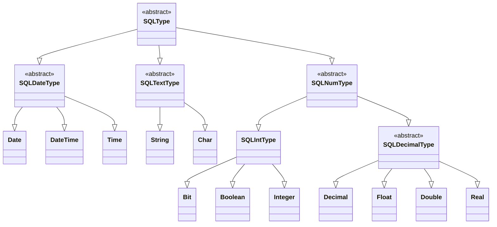

# SQL data types

Welcome to the comprehensive documentation of our **SQL type classes**.

Below, you'll discover detailed explanations of essential and abstract **SQL type classes**, along with additional insights.

Whether you're a beginner or an experienced developer, this guide aims to provide clarity and guidance.

# Table of contents

- [Class diagram](#class-diagram)
- [**Date types**](#date-types)
  - [Date](#date)
  - [DateTime](#datetime)
  - [Time](#time)
- [**Numeric types**](#numeric-types)
  - [Bit](#bit)
  - [Boolean](#boolean)
  - [Decimal](#decimal)
  - [Double](#double)
  - [Float](#float)
  - [Integer](#integer)
  - [Real](#real)
- [**Text types**](#text-types)
  - [Char](#char)
  - [String](#string)
- [**Creating a new data type**](#creating-a-new-data-type)
  - [Creating a new date type](#creating-a-new-date-type)
  - [Creating a new decimal type](#creating-a-new-decimal-type)
  - [Creating a new integer type](#creating-a-new-integer-type)
  - [Creating a new text type](#creating-a-new-text-type)
- [**Abstract classes**](#abstract-classes)
  - [SQLDateType](#sqldatetype)
  - [SQLDecimalType](#sqldecimaltype)
  - [SQLIntType](#sqlinttype)
  - [SQLNumType](#sqlnumtype)
  - [SQLTextType](#sqltexttype)
  - [SQLType](#sqltype)


## Class diagram



This class diagram shows the inheritance of the classes.

## **Date types**

## Date

Represents a **DATE data type** in SQL.

This class inherits from [**SQLDateType**](#sqldatetype) and provides functionality specific to the **DATE** data type in `yyyy-mm-dd` pattern.

This class is in `pysqlquery.types` package.

### Methods

#### `__init__() -> None`

Constructs a `Date` instance representing the **DATE** data type.

#### `__str__ -> str`

Returns a string representation of the class instance in SQL format.

The returned string will be used for constructing the SQL queries.

#### `validate_value(value: str) -> bool`

Validates if the passed value is valid for the **DATE** SQL type.

`True` if the value is valid for the **DATE** SQL type in `yyyy-mm-dd` pattern, `False` otherwise.

The returned bool value will be used by <a href="./table.md#column">Column</a> class for validate values coming from **DML commands**.

### Properties

#### `@property name -> str`

Returns the name of that SQL type - `'DATE'`.

#### `@property pattern -> str`

Returns the pattern of that **DATE** SQL type - `'%Y-%m-%d'`.

### Examples

```python
>>> date_type = Date()
>>> print(date_type)
DATE
>>> date_type.validate_value('2005-02-27')
True
>>> date_type.validate_value('27-02-2005')
False
>>> date_type.validate_value('abc')
False
>>> date_type.validate_value(10)
False
```

## DateTime

Represents a **DATETIME data type** in SQL.

This class inherits from [**SQLDateType**](#sqldatetype) and provides functionality specific to the **DATETIME** data type in `yyyy-mm-dd HH:MM:ss` pattern.

This class is in `pysqlquery.types` package.

### Methods

#### `__init__() -> None`

Constructs a `DateTime` instance representing the **DATETIME** data type.

#### `__str__ -> str`

Returns a string representation of the class instance in SQL format.

The returned string will be used for constructing the SQL queries.

#### `validate_value(value: str) -> bool`

Validates if the passed value is valid for the **DATETIME** SQL type.

`True` if the value is valid for the **DATETIME** SQL type in `yyyy-mm-dd HH:MM:ss` pattern, `False` otherwise.

The returned bool value will be used by <a href="./table.md#column">Column</a> class for validate values coming from **DML commands**.

### Properties

#### `@property name -> str`

Returns the name of that SQL type - `'DATETIME'`.

#### `@property pattern -> str`

Returns the pattern of that **DATETIME** SQL type - `'%Y-%m-%d %H:%M:%S'`.

### Examples

```python
>>> datetime_type = DateTime()
>>> print(datetime_type)
DATETIME
>>> datetime_type.validate_value('2005-02-27 12:45:10')
True
>>> datetime_type.validate_value('2005-02-27')
False
>>> datetime_type.validate_value('abc')
False
>>> datetime_type.validate_value(10)
False
```

## Time

Represents a **TIME data type** in SQL.

This class inherits from [**SQLDateType**](#sqldatetype) and provides functionality specific to the **TIME** data type in `HH:MM:ss` pattern.

This class is in `pysqlquery.types` package.

### Methods

#### `__init__() -> None`

Constructs a `Time` instance representing the **TIME** data type.

#### `__str__ -> str`

Returns a string representation of the class instance in SQL format.

The returned string will be used for constructing the SQL queries.

#### `validate_value(value: str) -> bool`

Validates if the passed value is valid for the **TIME** SQL type.

`True` if the value is valid for the **TIME** SQL type in `HH:MM:ss` pattern, `False` otherwise.

The returned bool value will be used by <a href="./table.md#column">Column</a> class for validate values coming from **DML commands**.

### Properties

#### `@property name -> str`

Returns the name of that SQL type - `'TIME'`.

#### `@property pattern -> str`

Returns the pattern of that **TIME** SQL type - `'%H:%M:%S'`.

### Examples

```python
>>> time_type = Date()
>>> print(time_type)
TIME
>>> time_type.validate_value('20:45:31')
True
>>> time_type.validate_value('20-45-31')
False
>>> time_type.validate_value('abc')
False
>>> time_type.validate_value(10)
False
```

## **Numeric types**

## Bit

Represents a **BIT data type** in SQL.

This class inherits from [**SQLIntType**](#sqlinttype) and provides functionality specific to the **BIT** data type.

This class is in `pysqlquery.types` package.

### Methods

#### `__init__()` -> None`

Constructs a `Bit` instance representing the **BIT** data type.

#### `__str__ -> str`

Returns a string representation of the class instance in SQL format.

The returned string will be used for constructing the SQL queries.

#### `validate_value(value: bool | int) -> bool`
Validates if the passed value is valid for the **BIT** SQL type.

Returns `True` if the value is valid for the **BIT** SQL type, `False` otherwise.

The returned bool value will be used by <a href="./table.md#column">Column</a> class for validate values coming from **DML commands**.

### Properties

#### `@property name -> str`

Returns the name of that SQL type - `'BIT'`.

#### `@property precision -> int | None`

Returns the precision of that **BIT** SQL type - `1`.

### Examples

```python
>>> bit_type = Bit()
>>> print(bit_type)
BIT
>>> bit_type.validate_value(True)
True
>>> bit_type.validate_value(False)
True
>>> bit_type.validate_value(1)
True
>>> bit_type.validate_value(0)
True
>>> bit_type.validate_value(15.45)
False
>>> bit_type.validate_value('abc')
False
```

## Boolean

Represents a **BOOLEAN data type** in SQL.

This class inherits from [**SQLIntType**](#sqlinttype) and provides functionality specific to the **BOOLEAN** data type.

This class is in `pysqlquery.types` package.

### Methods

#### `__init__()` -> None`

Constructs a `Boolean` instance representing the **BOOLEAN** data type.

#### `__str__ -> str`

Returns a string representation of the class instance in SQL format.

The returned string will be used for constructing the SQL queries.

#### `validate_value(value: bool) -> bool`
Validates if the passed value is valid for the **BOOLEAN** SQL type.

Returns `True` if the value is valid for the **BOOLEAN** SQL type, `False` otherwise.

The returned bool value will be used by <a href="./table.md#column">Column</a> class for validate values coming from **DML commands**.

### Properties

#### `@property name -> str`

Returns the name of that SQL type - `'BOOLEAN'`.

#### `@property precision -> int | None`

Returns the precision of that **BOOLEAN** SQL type - `1`.

### Examples

```python
>>> boolean_type = Boolean()
>>> print(boolean_type)
BOOLEAN
>>> boolean_type.validate_value(True)
True
>>> boolean_type.validate_value(False)
True
>>> boolean_type.validate_value(15.45)
False
>>> boolean_type.validate_value('abc')
False
```

## Decimal

Represents a **DECIMAL data type** in SQL.

This class inherits from [**SQLDecimalType**](#sqldecimaltype) and provides functionality specific to the **DECIMAL** data type.

This class is in `pysqlquery.types` package.

### Methods

#### `__init__(precision: int | None = None, scale: int | None = None)` -> None`

Constructs a `Decimal` instance representing the **DECIMAL** data type.

**Parameters**

- `precision : int | None` - The precision of **DECIMAL** type.
- `scale : int | None` - The scale of **DECIMAL** type (**if passed it must be lower than precision**).

#### `__str__ -> str`

Returns a string representation of the class instance in SQL format.

The returned string will be used for constructing the SQL queries.

#### `validate_value(value: float | int) -> bool`
Validates if the passed value is valid for the **DECIMAL** SQL type.

Returns `True` if the value is valid for the **DECIMAL** SQL type, `False` otherwise.

The returned bool value will be used by <a href="./table.md#column">Column</a> class for validate values coming from **DML commands**.

### Properties

#### `@property name -> str`

Returns the name of that SQL type - `'DECIMAL'`.

#### `@property precision -> int | None`

Returns the precision of that **DECIMAL** SQL type.

#### `@property scale -> int | None`

Returns the scale of that **DECIMAL** SQL type.

### Examples

```python
>>> decimal_type = Decimal()
>>> print(decimal_type)
DECIMAL
>>> decimal_type.validate_value(10)
True
>>> decimal_type.validate_value(10.5)
True

>>> decimal_type = Decimal(2)
>>> print(decimal_type)
DECIMAL(2)
>>> decimal_type.validate_value(10)
True
>>> decimal_type.validate_value(100)
False

>>> decimal_type = Decimal(3, 1)
>>> print(decimal_type)
DECIMAL(3, 1)
>>> decimal_type.validate_value(10)
True
>>> decimal_type.validate_value(100)
True
>>> decimal_type.validate_value(10.5)
True
>>> decimal_type.validate_value(1.55)
False
```

## Double

Represents a **DOUBLE data type** in SQL.

This class inherits from [**SQLDecimalType**](#sqldecimaltype) and provides functionality specific to the **DOUBLE** data type.

This class is in `pysqlquery.types` package.

### Methods

#### `__init__(precision: int | None = None, scale: int | None = None)` -> None`

Constructs a `Double` instance representing the **DOUBLE** data type.

**Parameters**

- `precision : int | None` - The precision of **DOUBLE** type.
- `scale : int | None` - The scale of **DOUBLE** type (**if passed it must be lower than precision**).

#### `__str__ -> str`

Returns a string representation of the class instance in SQL format.

The returned string will be used for constructing the SQL queries.

#### `validate_value(value: float | int) -> bool`
Validates if the passed value is valid for the **DOUBLE** SQL type.

Returns `True` if the value is valid for the **DOUBLE** SQL type, `False` otherwise.

The returned bool value will be used by <a href="./table.md#column">Column</a> class for validate values coming from **DML commands**.

### Properties

#### `@property name -> str`

Returns the name of that SQL type - `'DOUBLE'`.

#### `@property precision -> int | None`

Returns the precision of that **DOUBLE** SQL type.

#### `@property scale -> int | None`

Returns the scale of that **DOUBLE** SQL type.

### Examples

```python
>>> double_type = Double()
>>> print(double_type)
DOUBLE
>>> double_type.validate_value(10)
True
>>> double_type.validate_value(10.5)
True

>>> double_type = Double(2)
>>> print(double_type)
DOUBLE(2)
>>> double_type.validate_value(10)
True
>>> double_type.validate_value(100)
False

>>> double_type = Double(3, 1)
>>> print(double_type)
DOUBLE(3, 1)
>>> double_type.validate_value(10)
True
>>> double_type.validate_value(100)
True
>>> double_type.validate_value(10.5)
True
>>> double_type.validate_value(1.55)
False
```

## Float

Represents a **FLOAT data type** in SQL.

This class inherits from [**SQLDecimalType**](#sqldecimaltype) and provides functionality specific to the **FLOAT** data type.

This class is in `pysqlquery.types` package.

### Methods

#### `__init__(precision: int | None = None, scale: int | None = None)` -> None`

Constructs a `Float` instance representing the **FLOAT** data type.

**Parameters**

- `precision : int | None` - The precision of **FLOAT** type.
- `scale : int | None` - The scale of **FLOAT** type (**if passed it must be lower than precision**).

#### `__str__ -> str`

Returns a string representation of the class instance in SQL format.

The returned string will be used for constructing the SQL queries.

#### `validate_value(value: float | int) -> bool`
Validates if the passed value is valid for the **FLOAT** SQL type.

Returns `True` if the value is valid for the **FLOAT** SQL type, `False` otherwise.

The returned bool value will be used by <a href="./table.md#column">Column</a> class for validate values coming from **DML commands**.

### Properties

#### `@property name -> str`

Returns the name of that SQL type - `'FLOAT'`.

#### `@property precision -> int | None`

Returns the precision of that **FLOAT** SQL type.

#### `@property scale -> int | None`

Returns the scale of that **FLOAT** SQL type.

### Examples

```python
>>> float_type = Float()
>>> print(float_type)
FLOAT
>>> float_type.validate_value(10)
True
>>> float_type.validate_value(10.5)
True

>>> float_type = Float(2)
>>> print(float_type)
FLOAT(2)
>>> float_type.validate_value(10)
True
>>> float_type.validate_value(100)
False

>>> float_type = Float(3, 1)
>>> print(float_type)
FLOAT(3, 1)
>>> float_type.validate_value(10)
True
>>> float_type.validate_value(100)
True
>>> float_type.validate_value(10.5)
True
>>> float_type.validate_value(1.55)
False
```

## Integer

Represents a **INTEGER data type** in SQL.

This class inherits from [**SQLIntType**](#sqlinttype) and provides functionality specific to the **INTEGER** data type.

This class is in `pysqlquery.types` package.

### Methods

#### `__init__()` -> None`

Constructs a `Integer` instance representing the **INTEGER** data type.

#### `__str__ -> str`

Returns a string representation of the class instance in SQL format.

The returned string will be used for constructing the SQL queries.

#### `validate_value(value: int) -> bool`
Validates if the passed value is valid for the **INTEGER** SQL type.

Returns `True` if the value is valid for the **INTEGER** SQL type, `False` otherwise.

The returned bool value will be used by <a href="./table.md#column">Column</a> class for validate values coming from **DML commands**.

### Properties

#### `@property name -> str`

Returns the name of that SQL type - `'INTEGER'`.

#### `@property precision -> int | None`

Returns the precision of that **INTEGER** SQL type.

### Examples

```python
>>> int_type = Integer()
>>> print(int_type)
INTEGER
>>> int_type.validate_value(10)
True
>>> int_type.validate_value(10000000000000)
True
>>> int_type.validate_value(15.45)
False

>>> int_type = Integer(2)
>>> print(int_type)
INTEGER(2)
>>> int_type.validate_value(10)
True
>>> int_type.validate_value(100)
False
>>> int_type.validate_value(1.5)
False
```

## Real

Represents a **REAL data type** in SQL.

This class inherits from [**SQLDecimalType**](#sqldecimaltype) and provides functionality specific to the **REAL** data type.

This class is in `pysqlquery.types` package.

### Methods

#### `__init__(precision: int | None = None, scale: int | None = None)` -> None`

Constructs a `Real` instance representing the **REAL** data type.

**Parameters**

- `precision : int | None` - The precision of **REAL** type.
- `scale : int | None` - The scale of **REAL** type (**if passed it must be lower than precision**).

#### `__str__ -> str`

Returns a string representation of the class instance in SQL format.

The returned string will be used for constructing the SQL queries.

#### `validate_value(value: float | int) -> bool`
Validates if the passed value is valid for the **REAL** SQL type.

Returns `True` if the value is valid for the **REAL** SQL type, `False` otherwise.

The returned bool value will be used by <a href="./table.md#column">Column</a> class for validate values coming from **DML commands**.

### Properties

#### `@property name -> str`

Returns the name of that SQL type - `'REAL'`.

#### `@property precision -> int | None`

Returns the precision of that **REAL** SQL type.

#### `@property scale -> int | None`

Returns the scale of that **REAL** SQL type.

### Examples

```python
>>> real_type = Real()
>>> print(real_type)
REAL
>>> real_type.validate_value(10)
True
>>> real_type.validate_value(10.5)
True

>>> real_type = Real(2)
>>> print(real_type)
REAL(2)
>>> real_type.validate_value(10)
True
>>> real_type.validate_value(100)
False

>>> real_type = Real(3, 1)
>>> print(real_type)
REAL(3, 1)
>>> real_type.validate_value(10)
True
>>> real_type.validate_value(100)
True
>>> real_type.validate_value(10.5)
True
>>> real_type.validate_value(1.55)
False
```

## **Text types**

## Char

Represents a **CHAR data type** in SQL.

This class inherits from [**SQLTextType**](#sqltexttype) and provides functionality specific to the **CHAR** data type.

This class is in `pysqlquery.types` package.

### Methods

#### `__init__(length: int | None = None) -> None`

Constructs a `Char` instance representing the **CHAR** data type.

**Parameters**

- `length : int | None` - The length of **CHAR** type (if not passed, defaults to `1`).

#### `__str__ -> str`

Returns a string representation of the class instance in SQL format.

The returned string will be used for constructing the SQL queries.

#### `validate_value(value: str) -> bool`

Validates if the passed value is valid for the **CHAR** SQL type.

Returns `True` if the value is valid for the **CHAR** SQL type, `False` otherwise.

The returned bool value will be used by <a href="./table.md#column">Column</a> class for validate values coming from **DML commands**.

### Properties

#### `@property name -> str`

Returns the name of that SQL type - `'CHAR'`.

#### `@property length -> int | None`

Returns the length of that **CHAR** SQL type.

### Examples

```python
>>> char_type = Char()
>>> print(char_type)
CHAR
>>> char_type.validate_value('a')
True
>>> char_type.validate_value('ab')
False
>>> char_type = Char(3)
>>> print(char_type)
CHAR(3)
>>> char_type.validate_value('abc')
True
>>> char_type.validate_value('abcd')
False
>>> char_type.validate_value(12)
False
```

## String

Represents a **VARCHAR data type** in SQL.

This class inherits from [**SQLTextType**](#sqltexttype) and provides functionality specific to the **VARCHAR** data type.

This class is in `pysqlquery.types` package.

### Methods

#### `__init__(length: int | None = None) -> None`

Constructs a `String` instance representing the **VARCHAR** data type.

**Parameters**

- `length : int | None` - The length of **VARCHAR** type.

#### `__str__ -> str`

Returns a string representation of the class instance in SQL format.

The returned string will be used for constructing the SQL queries.

#### `validate_value(value: str) -> bool`

Validates if the passed value is valid for the **VARCHAR** SQL type.

Returns `True` if the value is valid for the **VARCHAR** SQL type, `False` otherwise.

The returned bool value will be used by <a href="./table.md#column">Column</a> class for validate values coming from **DML commands**.

### Properties

#### `@property name -> str`

Returns the name of that SQL type - `'VARCHAR'`.

#### `@property length -> int | None`

Returns the length of that **VARCHAR** SQL type.

### Examples

```python
>>> str_type = String()
>>> print(str_type)
VARCHAR
>>> str_type.validate_value('abc')
True
>>> str_type.validate_value('abcdefghijklmnopqrstuvwxyz')
True
>>> str_type.validate_value(10)
False
>>> str_type = String(4)
>>> print(str_type)
VARCHAR(4)
>>> str_type.validate_value('ab')
True
>>> str_type.validate_value('abcd')
True
>>> str_type.validate_value('abcde')
False
```

## **Creating a new data type**

You can create a new data type easily, extending your data type class from [SQLDateType](#sqldatetype) for date data types, [SQLDecimalType](#sqldecimaltype) for decimal number data types, [SQLIntType](#sqlinttype) for integer number data types or [SQLTextType](#sqltexttype) for text data types, and overriding the necessary methods.

### Methods that will must be overridden

- `__init__`
- `__str__` - for SQL representation
- `validate_value` - will be used by <a href="./table.md#column">Column</a> class for validate values coming from **DML commands**.

### Examples

### Creating a new date type

```python
from pysqlquery.types.base import SQLDateType

class NewDateType(SQLDateType):
    _TYPE_NAME = 'new_type'

    def __init__(self) -> None:
        DATE_PATTERN = '%Y' # 4-digit year
        super().__init__(self._TYPE_NAME, DATE_PATTERN)

    def __str__(self) -> str:
        rendered_value = super().name # 'NEW_TYPE'

        return rendered_value

    def validate_value(self, value: str) -> bool:
        # Insert the boolean logic to validate
        # the value according the SQL data type
        # (True if value is valid)
```

### Using it

```python
>>> new_date_type = NewDateType()
>>> print(new_date_type)
NEW_TYPE
>>> new_date_type.validate_value('2024')
True
>>> new_date_type.validate_value('abc')
False
>>> new_date_type.validate_value(10)
False
```

### Creating a new decimal type

```python
from pysqlquery.types.base import SQLDecimalType

class NewDecimalType(SQLDecimalType):
    _TYPE_NAME = 'new_type'

    def __init__(self, precision: int | None = None, scale: int | None = None) -> None:
        super().__init__(self._TYPE_NAME, precision, scale)

    def __str__(self) -> str:
        rendered_value = super().name # 'NEW_TYPE'

        if super().precision:
            rendered_value += f'({super().precision}' # 'NEW_TYPE(precision)'

            if super().scale is not None:
                rendered_value += f', {super().scale}' # 'NEW_TYPE(precision, scale)'

            rendered_value += ')'

        return rendered_value

    def validate_value(self, value: float | int) -> bool:
        # Insert the boolean logic to validate
        # the value according the SQL data type
        # (True if value is valid)
```

### Using it

```python
>>> new_decimal_type = NewDecimalType()
>>> print(new_decimal_type)
NEW_TYPE
>>> new_decimal_type.validate_value(40.65)
True
>>> new_decimal_type.validate_value(40)
True
>>> new_decimal_type.validate_value('abc')
False

>>> new_decimal_type = NewDecimalType(3)
>>> print(new_decimal_type)
NEW_TYPE(3)
>>> new_decimal_type.validate_value(400)
True
>>> new_decimal_type.validate_value(40.6)
True
>>> new_decimal_type.validate_value(4000)
False

>>> new_decimal_type = NewDecimalType(3, 1)
>>> print(new_decimal_type)
NEW_TYPE(3, 1)
>>> new_decimal_type.validate_value(400)
True
>>> new_decimal_type.validate_value(40.6)
True
>>> new_decimal_type.validate_value(40.65)
False
```

### Creating a new integer type

```python
from pysqlquery.types.base import SQLIntegerType

class NewIntegerType(SQLIntegerType):
    _TYPE_NAME = 'new_type'

    def __init__(self, precision: int | None = None) -> None:
        super().__init__(self._TYPE_NAME, precision)

    def __str__(self) -> str:
        rendered_value = super().name # 'NEW_TYPE'

        if super().precision:
            rendered_value += f'({super().precision})' # 'NEW_TYPE(precision)'

        return rendered_value

    def validate_value(self, value: int) -> bool:
        # Insert the boolean logic to validate
        # the value according the SQL data type
        # (True if value is valid)
```

### Using it

```python
>>> new_integer_type = NewIntegerType()
>>> print(new_integer_type)
NEW_TYPE
>>> new_integer_type.validate_value(40)
True
>>> new_integer_type.validate_value(40000000)
True
>>> new_integer_type.validate_value(40.65)
False
>>> new_integer_type.validate_value('abc')
False

>>> new_integer_type = NewIntegerType(3)
>>> print(new_integer_type)
NEW_TYPE(3)
>>> new_integer_type.validate_value(400)
True
>>> new_integer_type.validate_value(4000)
False
>>> new_integer_type.validate_value(40.6)
False
```

### Creating a new text type

```python
from pysqlquery.types.base import SQLTextType

class NewTextType(SQLTextType):
    _TYPE_NAME = 'new_type'

    def __init__(self, length: int | None = None) -> None:
        super().__init__(self._TYPE_NAME, length)

    def __str__(self) -> str:
        rendered_value = super().name # 'NEW_TYPE'

        if super().length:
            rendered_value += f'({super().length})' # 'NEW_TYPE(length)'

        return rendered_value

    def validate_value(self, value: str) -> bool:
        # Insert the boolean logic to validate
        # the value according the SQL data type
        # (True if value is valid)
```

### Using it

```python
>>> new_text_type = NewTextType()
>>> print(new_text_type)
NEW_TYPE
>>> new_text_type.validate_value('abc')
True
>>> new_text_type.validate_value('abcdefghijklmnopqrstuvwxyz')
True
>>> new_text_type.validate_value(40)
False

>>> new_text_type = NewTextType(3)
>>> print(new_text_type)
NEW_TYPE(3)
>>> new_text_type.validate_value('ab')
True
>>> new_text_type.validate_value('abc')
True
>>> new_text_type.validate_value('abcd')
False
```

## **Abstract classes**

## SQLDateType

Abstract class for constructing **date SQL type classes**.

This class inherits from [**SQLType**](#sqltype) and provides the basic structures for constructing concrete classes that represent date SQL types or other abstract classes for different kinds of date SQL types.

This class **must be inherited** by concrete or other abstract ones.

This class is in `pysqlquery.types.base` package.

### Methods

#### `__init__(sql_type_name: str, date_pattern: str) -> None`

**Parameters**

- `sql_type_name : str` - The name of date SQL type.
- `date_pattern : str` - The pattern of date SQL type.

### Properties

#### `@property pattern -> str`

Returns the pattern of that date SQL type.

## SQLDecimalType

Abstract class for constructing **decimal SQL type classes**.

This class inherits from [**SQLNumType**](#sqlnumtype) and provides the basic structures for constructing concrete classes that represent decimal SQL types or other abstract classes for different kinds of decimal SQL types.

This class **must be inherited** by concrete or other abstract ones.

This class is in `pysqlquery.types.base` package.

### Methods

#### `__init__(sql_type_name: str, precision: int | None, scale: int | None) -> None`

**Parameters**

- `sql_type_name : str` - The name of decimal SQL type.
- `precision : int | None` - The precision of decimal SQL type.
- `scale : int | None` - The scale of decimal SQL type (if passed, it must be lower than precision).

### Properties

#### `@property scale -> int | None`

Returns the scale of that decimal SQL type. If the scale is not applicable, it returns `None`.

## SQLIntType

Abstract class for constructing **integer SQL type classes**.

This class inherits from [**SQLNumType**](#sqlnumtype) and provides the basic structures for constructing concrete classes that represent integer SQL types or other abstract classes for different kinds of integer SQL types.

This class **must be inherited** by concrete or other abstract ones.

This class is in `pysqlquery.types.base` package.

## SQLNumType

Abstract class for constructing **numeric SQL type classes**.

This class inherits from [**SQLType**](#sqltype) and provides the basic structures for constructing other abstract classes representing different kinds of numeric SQL types.

This class **must be inherited** by abstract ones.

This class is in `pysqlquery.types.base` package.

### Methods

#### `__init__(sql_type_name: str, precision: int | None) -> None`

**Parameters**

- `sql_type_name : str` - The name of SQL type.
- `precision : int | None` - The precision of SQL type.

### Properties

#### `@property precision -> int | None`

Returns the precision of that numeric SQL type. If the precision is not applicable, it returns `None`.

## SQLTextType

Abstract class for constructing **text SQL type classes**.

This class inherits from [**SQLType**](#sqltype) and provides the basic structures for constructing concrete classes that represent text SQL types or other
abstract classes for different kinds of text SQL types.

This class **must be inherited** by concrete or other abstract ones.

This class is in `pysqlquery.types.base` package.

### Methods

#### `__init__(sql_type_name: str, length: int | None) -> None`

**Parameters**

- `sql_type_name : str` - The name of SQL type.
- `length : int | None` - The length of SQL type.

### Properties

#### `@property length -> int | None`

Returns the length of that text SQL type. If the length is not applicable , it returns `None`.

## SQLType

Abstract class for construct abstract **SQL type classes**.

This class provides the basic structures for construct
abstract classes for **kind of SQL types**.

This class **must be inherited** by abstract one.

This class is in `pysqlquery.types.base` package.

### Methods

#### `__init__(sql_type_name: str) -> None`

**Parameters**

- `sql_type_name : str` - The name of SQL type.

#### `@abstractmethod __str__ -> str`

Returns a string representation of the class instance in SQL format.

The returned string will be used for constructing the SQL queries.

It's an abstract method, **the concrete subclasses must implement it**.

#### `@abstractmethod validate_value(value: Any) -> bool`

Returns is the passed value is a valid value for that SQL type.

The returned bool value will be used by <a href="./table.md#column">Column</a> class for validate values coming from **DML commands**.

It's an abstract method, **the concrete subclasses must implement it**.

### Properties

#### `@property name -> str`

Returns the name of that SQL type.
