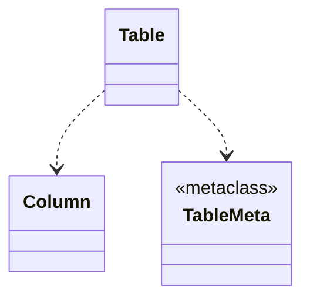

# SQL table and column

Welcome to the comprehensive documentation of our **SQL table and column classes**.

Below, you'll discover detailed explanations of essential **SQL table and column classes**, along with additional insights.

Whether you're a beginner or an experienced developer, this guide aims to provide clarity and guidance.

# Table of contents

- [**Class diagram**](#class-diagram)
- [Table](#table)
- [Column](#column)
- [TableMeta](#tablemeta)


## **Class diagram**



This class diagram shows the dependency of the classes.

## Table

Represents a **SQL table**.

This class **must be used as** superclass for a table class, and subclass **must contains**
1 or more Column class for **SQL columns** as class attributes.

This class is in `pysqlquery.table` package.

### Dunder variables

#### `__tablename__ : str | None`

If you assing a value, it will be used as table's name, otherwise the class name will be used.

#### `__constraints__ : list[NamedConstraint] | None`

A list of NamedConstraint, if you assign, the constraints will be insert in SQL query in **ALTER TABLE** form.

If named constraints are passed in a table, they can modifying table's columns.

### Methods

#### `__init__(*, create_if_not_exists: bool, test: bool) -> None`

The subclass will receive this method for constructs a `Table` instance representing a **SQL table**.

**Parameters**

- `create_if_not_exists : bool` - If this table must receive the IF NOT EXISTS clause.
- `test : bool` - If this table must added to the table global list (True for no).

#### `__str__ -> str`

Returns a string representation of the class instance in SQL format.

The returned string will be used for constructing the **SQL queries**.

#### `@classmethod save_all_tables(path: str, encoding: str = 'UTF-8')`

Save all tables that you have been created (except the ones with `test = True`) in a file.

### Properties

#### `@property tablename -> str`

Returns the table's name.

#### `@property column -> list[Column]`

Returns a list with all table's columns.

#### `@property primary_key -> list[Column]`

Returns a list with all table's columns that are primary keys.

#### `@property named_constraints -> list[NamedConstraint] | None`

If you have been inserted **named constraints** in `__constraints__` list, returns these ones, None otherwise.

#### `@property test -> bool`

Returns if the table is a test table (it isn't in table global list).

#### `@classmethod @property all_tables -> list[Table]`

Returns the global list with all tables that you have been created (except the ones with `test = True`).

#### `@classmethod @property create_query_all_tables -> str | None`

Returns **SQL DLL commands** for construct all tables that you have been created (except the ones with `test = True`).

### Examples

A simple table

```python
from pysqlquery import Table, Column, Integer, String

class MyTable(Table):
    id = Column(Integer, primary_key=True, auto_increment='mysql')
    name = Column(String(50))

my_table = MyTable()
print(my_table)
```
```sql
CREATE TABLE MYTABLE (
    id INTEGER AUTO_INCREMENT NOT NULL,
    name VARCHAR(50) NOT NULL,

    PRIMARY KEY (id)
);
```

A table with named constraints and a custom name

```python
class MyTable(Table):
    __tablename__ = 'tb_customer'

    id = Column(Integer, auto_increment='mysql')
    name = Column(String(50))

    __constraints__ = [
        PrimaryKeyConstraint('pk_tb_customer', 'id')
    ]

my_table = MyTable()
print(my_table)
```
```sql
CREATE TABLE TB_CUSTOMER (
    id INTEGER AUTO_INCREMENT NOT NULL,
    name VARCHAR(50) NOT NULL
);

ALTER TABLE TB_CUSTOMER
    ADD CONSTRAINT pk_tb_customer PRIMARY KEY (id);
```

Adding IF NOT EXISTS clause

```python
class MyTable(Table):
    id = Column(Integer, primary_key=True, auto_increment='mysql')
    name = Column(String(50))

my_table = MyTable(create_if_not_exists=True)
print(my_table)
```
```sql
CREATE TABLE IF NOT EXISTS MYTABLE (
    id INTEGER AUTO_INCREMENT NOT NULL,
    name VARCHAR(50) NOT NULL,

    PRIMARY KEY (id)
);
```

## Column

Represents a **SQL table column.**

This class **must be used** in a [SQL table class](#table).

If named constraints are passed in a table, they can modifying table's columns.

This class is in `pysqlquery.table` package.

### Methods

#### `__init__(data_type: SQLType, foreign_key: ForeignKey | None = None, *, primary_key: bool = False, auto_increment: st | None = None, nullable: bool = False, unique: bool = False, default: Any = None) -> None`

Constructs a `Column` instance representing a **SQL table column**.

**Parameters**

- `data_type : SQLType` - The column's data type (can be a class or a instance).
- `foreign_key : ForeignKey | None` - The column's unnamed FOREIGN KEY constraint.
- `primary_key : bool` - If the column is primary key.
- `auto_increment : str | None` - The kind of auto increment that column can receive.
- `nullable : bool` - If the column is nullable.
- `unique : bool` - If the column is unique.
- `default : Any` - The column's default value (**must satisfying** the column's data type).

Available values for `auto_increment` param:

- `'mssql'` - for [Microsoft SQL SERVER](https://www.microsoft.com/en-us/sql-server/sql-server-2022) (`IDENTITY(1, 1)`)
- `'mssql'` - for [MySQL](https://www.mysql.com) (`AUTO_INCREMENT`)
- `'sqlite'` - for [SQLite](https://www.sqlite.org/index.html) (`AUTO INCREMENT`)
- `'postgre'` - for [Postgre SQL](https://www.postgresql.org) (`SERIAL`)

#### `__str__ -> str`

Returns a string representation of the class instance in SQL format.

The returned string will be used for constructing the **SQL queries**.

### Properties

#### `@property name -> str`

Returns the column's name.

#### `@property data_type -> SQLType`

Returns the column's name.

#### `@property foreign_key -> ForeignKey | ForeignKeyConstraint | None`

Returns the column's FOREIGN KEY constraint if exists.

#### `@property primary_key -> bool`

Returns if the column is primary key.

#### `@property auto_increment -> bool`

Returns if the column own auto increment.

#### `@property nullable -> bool`

Returns if the column is nullable.

#### `@property unique -> bool`

Returns if the column is unique.

#### `@property default -> bool`

Returns the column's default value if exists, None otherwise.

### Examples

A simple column

```python
>>>from pysqlquery import Table, Column, Integer
>>> class MyTable(Table):
...     col = Column(Integer)
...
>>> my_table = MyTable()
>>> print(my_table.col)
```
```sql
col INTEGER NOT NULL
```

Columns with some modifiers:

```python
>>> class TbProducts(Table):
...     id = Column(Integer(6), primary_key=True, auto_incremente='mysql')
...     name = Column(String(50), unique=True)
...     price = Column(Float(7, 2), default=1)
```

When <a href="./constraints.md#named-constraints">`NamedConstraint`</a> is passed for table, it can modifying columns.

```python
>>> class MyTable(Table):
...     un_col = Column(Char(10))
...     __constraints__ = [UniqueConstraint('un_my_table_un_col', 'un_col')]
...
>>> my_table = MyTable()
>>> my_table.un_col.unique
True
```

## TableMeta

This class is used as meta class for SQL table classes.

This class is in `pysqlquery.table.base` package.
